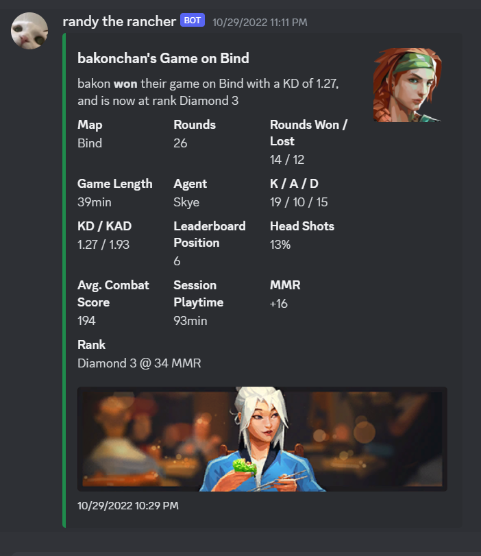
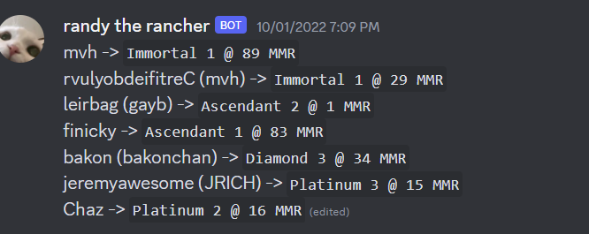

# Valorant Tracker
Simple bot used to track a list of player's MMR and or log a list of player's games.

# Usage
`./ --token <bot token> --game_channel (optional game channel id) --mmr_channel (optional mmr channel id)`

On first start, the program will automatically create a ./players.txt file, inside add all of your player tags separated by new lines, ex.
```
Cooper#NA123
Joe#EU631
Mom#OKAY33
```


<br>Example of a game embed

<br>Example of an MMR embed